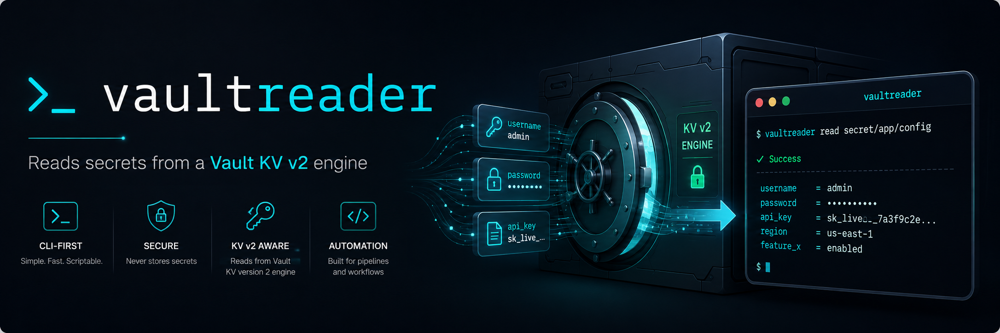

# 

# vaultreader
___
A lightweight Hashicorp Vault secret reader.

# Introduction

This tool reads secrets off a Hashicorp Vault secret engine, specifically, a KV engine v2+. The engine thus supports versionned KV secrets.
___
# Pre-requisites

The following environment variables are not a hard requirement in the sense that they can be over-ridden with flags, in parentheseses.

## VAULT_ADDR (`-a $address`)
The actual server's address

## VAULT_TOKEN (`-t $token`)
The authorization token to be authenticate against the Vault service. If neither the env var nor `-t` is set, `~/.vault-token` is used as a fallback.

## Optional: Quiet (`-q`)
This will suppress the output; useful when the tool is used in a CI/CD toolchain

## Optional: TEXT or JSON output (`-o {text|json}`)
If `-q` is invoked this option is ignored. If `-q` is not invoked, the output defaults to `-o text`

___
# How to use:
Simple: `vaultreader KV_ENGINE [-a vaultserver] [-t auth_token] [-v secret version number] [-f field name] secret_path`

- If `-v` is omitted, the latest secret's version will be read
- if `-f` is omitted, all fields in the secret will be fetched
___
# Building the software:
Whichever method you choose, go must be installed on the build machine (... well of course !). Check the file `go.version` to see which version to use.

## From source:
Again, simple:
1. `cd $REPODIR/src`
2. (optional): run `./updateBuildDeps.sh`, to update all packages before compiling
3. `./build.sh`
By default it will compile the tool as `/opt/bin/vaultreader`, unless you over-ride this with
`./build.sh $OUTPUT`, where the binary would be compiled as $OUTPUT.

## Binary packages
Assuming you meet each distros' build framework requirements

Regardless of the targeted distro, examine its `__{alpine,archlinux,debian,redhat}/Makefile` and run the appropriate recipe (`make build` or `make release`)

`make release` expects a fully configured `nxtools` app so it can upload to the appropriate *Nexus Repository* Manager server

